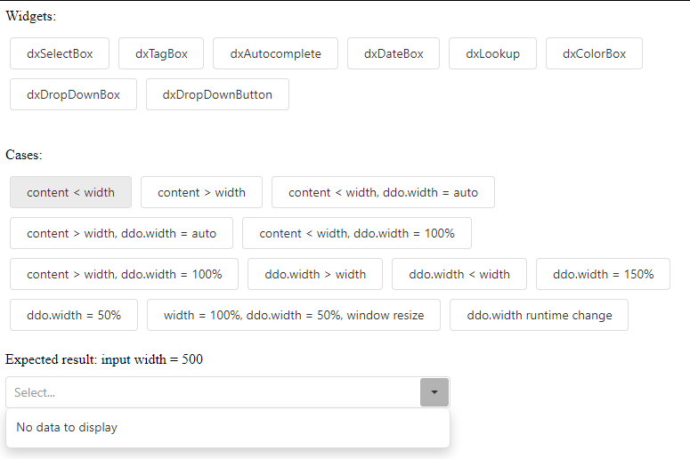

# devextreme-ddeditors-testing-tool

## Launch:

1. Copy `tool.html` to `DevExtreme/playground`
2. Open the page in browser
3. Click on `Widgets` block buttons to select the widget
4. Click on `Cases` block buttons to start run a specific case
5. Enjoy

